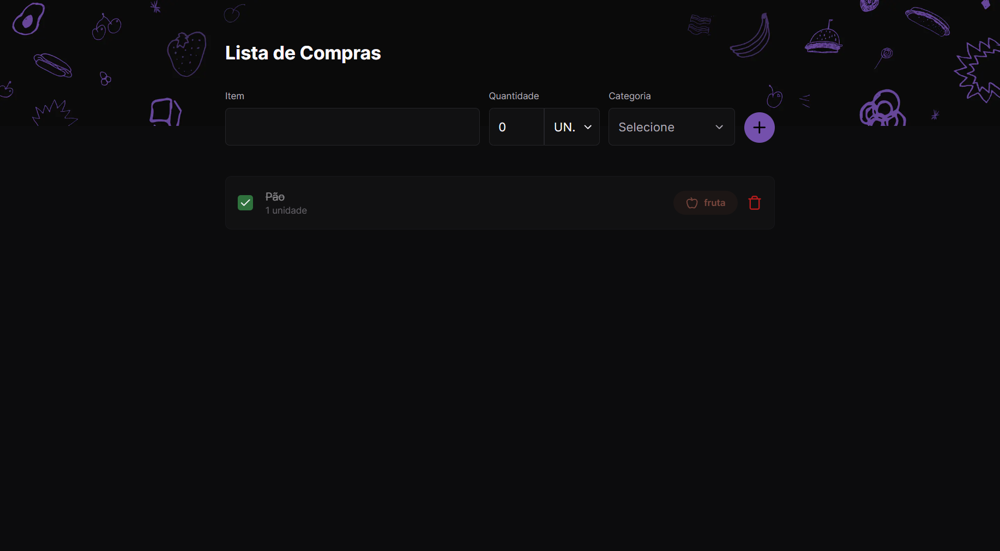

 

  

## 🚀 Tecnologias

Tecnologias utilizadas no projeto:

- ReactJS
- NextJS
- Typescript
- Tailwindcss

 

## 💻 Projeto

O Shopping List é uma aplicação que você adicionou o produto em uma lista para comprar no mercado e marca caso já tenha pego.

 

## ⚒️ Features

- [x] Adicionar produto na lista
- [x] Remove produto da lista
- [x] Marca como pego o produto

- [x] Versão web
- [x] Versão mobile

 

## 🔖 Layout

Layout da aplicação no [figma](https://www.figma.com/community/file/1276169043084346929).

 

## 🌐 Deploy

Você pode ver o site clicando <a href="https://shopping-list-liard-seven.vercel.app/" target="_blank">nesse link</a>.

 

## :memo: Licença

Esse projeto está sob a licença MIT. Veja o arquivo <a href="https://github.com/Gabriel-Sousa/shopping-list/blob/master/.github/LICENSE" target="_blank">LICENSE</a>  para mais detalhes.

---

Feito com ♥ por Gabriel Sousa
